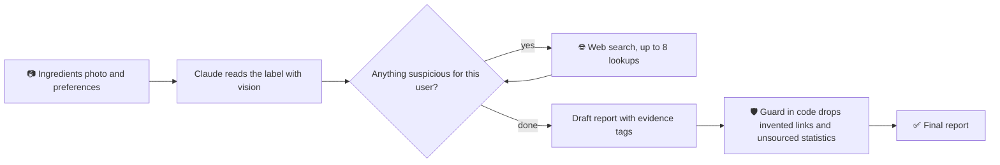

# 🤖 Ingredient Checker: an AI agent for what's in your food

An AI agent that reads a product's ingredients list from a photo, researches the suspicious ingredients on the web, and tells you whether the product suits **your** diet or allergies. It keeps what is confirmed apart from what is only inferred, and it never quotes a number without a source link.

Built for people who avoid things for personal reasons (halal, vegan...) or because of allergies (gluten, nuts, dairy...).

> Built as a hands-on project to explore how to design a reliable AI agent: vision, tool use, and guardrails that don't rely on the model behaving.

## 🧩 Why it's an agent, not just a prompt

Instead of answering in one shot, the model works in a loop and decides each step itself:



- **Perceives:** reads the label and the logos on the pack (vegan, halal, gluten-free...) from the photo.
- **Decides:** chooses which ingredients are worth researching for *this* user and what to search for.
- **Acts:** calls a live web-search tool, up to 8 times, and reads what comes back.
- **Checks itself:** the server verifies the draft instead of trusting it (see below).

## ✨ Features

- 📷 **Photo in, report out.** Snap the ingredients list, and optionally the front of the pack to help the search. Works from a phone camera or a file.
- ✅ **Pick your preferences.** Halal, Gluten-free, Nut allergy, Dairy-free, Vegan, or **Other** for anything else in your own words. Choose as many as you like; they are saved on your device.
- 🏷️ **Reads the pack, not just the list.** A vegan or halal logo counts as the manufacturer's statement and is used as evidence.
- 📊 **Published statistics, never guesses.** For a suspicious ingredient it shows what has been published ("gelatin: mostly pig skin, about 46% worldwide") with the source. If no source states a number, it says *No documented statistic*.
- 🚫 **Not a product photo? It tells you.** A selfie or a tree gets a polite "this isn't an ingredients list" instead of a made-up report.
- 🌍 **Speaks your language.** The interface is English. Write your notes in Arabic and the report comes back in Arabic (right-to-left).
- 📋 **Copy the result** or start a new check with one tap. Responsive layout for phone and desktop.

## 🛡️ How it stays honest

- Every point is tagged **Confirmed**, **Inferred** (with a likelihood) or **Unknown**.
- Statistics are shown only with a link, and the server drops any statistics line whose link did not actually appear in the search results.
- It never says a product is "safe". It says *suitable*, *not suitable* or *needs verification*.
- It only flags what is actually listed on the label. No speculation about hidden or trace substances.

## 🚀 Quick start

You need Node.js (developed on Node 24) and an [Anthropic API key](https://console.anthropic.com/).

```bash
git clone https://github.com/a-Hussain314/ingredient-checker-ai-agent.git
cd ingredient-checker-ai-agent
npm install
```

Create a `.env` file in the project root:

```
ANTHROPIC_API_KEY=your-key-here
```

Start it:

```bash
npm run start:dev
```

Open <http://localhost:3000>.

### Use it from your phone

Put the phone on the same Wi-Fi as your computer and open `http://<your-computer-ip>:3000`. The file picker opens the camera on most phones.

> ⚠️ There is no login. Anyone who can reach the address can run analyses on **your** API credit. Keep it on your home network, and add authentication before exposing it to the internet.

## 🔌 API

`POST /product/analyze` with JSON:

| Field | Type | Notes |
| --- | --- | --- |
| `image` | string | Base64 image of the ingredients list (no `data:` prefix). Required. |
| `productImage` | string \| null | Base64 image of the product front. Optional. |
| `mediaType` | string | `image/jpeg`, `image/png`, `image/webp` or `image/gif`. |
| `preferences` | string[] | Any of `halal`, `gluten_free`, `nut_allergy`, `dairy_free`, `vegan`. |
| `notes` | string | Free text, up to 2000 characters. The report follows its language. |

It answers with `{ "status": "ok", "report": "..." }` or `{ "status": "not_a_label", "message": "..." }`. The report uses small English markers (`[[stats]]`, `[confirmed|...]`) so the page can style it whatever language the text is in.

## 🗂️ Project layout

```
src/
  main.ts                      app bootstrap (10 MB JSON limit for photos)
  app.module.ts                serves public/ and registers the product module
  product/
    preferences.ts             what each preference means, written for the model
    product.controller.ts      validates the request
    product.service.ts         the agent: prompt, Claude call with web search, source guard
public/
  index.html  script.js  style.css   the whole front end, no framework
```

## ⚙️ Good to know

- **Model and cost.** The model is set by `MODEL` in `src/product/product.service.ts`. Each analysis can run up to 8 web searches, so it costs more than a plain chat message. Photos are shrunk in the browser (max 1600 px) before upload.
- **Privacy.** Your photos and preferences are sent to the Anthropic API for analysis. Preferences are stored only in your browser's local storage.
- **It can be wrong.** This is a helper for your own judgment, not a religious ruling or medical advice. A claim printed on a pack is the manufacturer's own claim, and statistics are only as good as the source the model found. The guard checks that a link is real, not that the page contains the quoted number. When something matters, ask the manufacturer.
- **No automated tests yet.** It has been checked by hand.

## 🛠️ Built with

[NestJS](https://nestjs.com/) · TypeScript · [Claude](https://www.anthropic.com/claude) (vision, tool use and web search) · plain HTML, CSS and JavaScript
