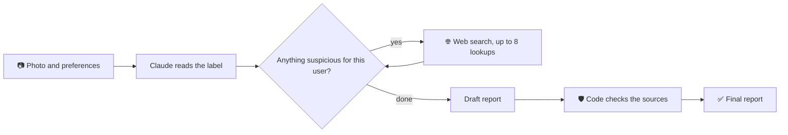

# 🤖 Ingredient Checker

An AI agent that reads a product's ingredients list from a photo, researches it on the web, and tells you whether it suits **your** diet or allergies.

- 📷 Photo in, short report out
- ✅ Works for halal, gluten-free, nut allergy, dairy-free, vegan, or anything you describe yourself
- 🏷️ Every point is marked **Confirmed**, **Inferred** or **Unknown**, and numbers always come with a source link

> Built as a hands-on project to explore how to design a reliable AI agent: vision, tool use, and guardrails that don't rely on the model behaving.

## 👣 How to use it

1. **Pick what you avoid.** Tick as many as you like: Halal, Gluten-free, Nut allergy, Dairy-free, Vegan. Choose **Other** to describe anything else in your own words (Arabic works too, and the report will answer in Arabic).
2. **Add a photo of the ingredients list.** It's required. A photo of the front of the pack is optional but helps the search. On a phone, the button opens the camera.
3. **Tap "Analyze product".** It reads the label and researches the suspicious ingredients. This can take up to a minute.
4. **Read the report.** You can copy it, or tap "Check a new product" to start over. Your preferences are remembered.

If the photo isn't an ingredients list, the agent says so instead of guessing.

## 🚀 Run it yourself

You need [Node.js](https://nodejs.org/) (developed on Node 24) and an [Anthropic API key](https://console.anthropic.com/).

```bash
git clone https://github.com/a-Hussain314/ingredient-checker-ai-agent.git
cd ingredient-checker-ai-agent
npm install
```

Create a file named `.env` in that folder with your key:

```
ANTHROPIC_API_KEY=your-key-here
```

Then start it and open <http://localhost:3000>:

```bash
npm run start:dev
```

**On your phone:** connect it to the same Wi-Fi and open `http://<your-computer-ip>:3000`.

> ⚠️ There is no login. Anyone who can reach the address can use **your** API credit. Keep it on your home network, and add authentication before putting it on the internet.

## 🧩 How it works

The model doesn't answer in one shot. It works in a loop and decides each step itself:



- **It reads the whole pack,** including vegan or halal logos, and treats them as the manufacturer's statement.
- **It never says "safe".** It says suitable, not suitable, or needs verification.
- **It doesn't speculate.** It only flags what is actually listed on the label.
- **The server checks the model.** Any statistic whose link didn't appear in the search results is dropped.

## ℹ️ Good to know

- **Cost:** each check can use several web searches, so it costs more than a plain chat message. The model is set by `MODEL` in `src/product/product.service.ts`.
- **Privacy:** your photos and preferences are sent to the Anthropic API. Preferences are saved only in your browser.
- **It can be wrong.** It's a helper for your own judgment, not a religious ruling or medical advice. The source check confirms a link is real, not that the page contains the quoted number. When it matters, ask the manufacturer.
- **No automated tests yet.** It has been checked by hand.

<details>
<summary><b>API</b></summary>

`POST /product/analyze` with JSON:

| Field | Type | Notes |
| --- | --- | --- |
| `image` | string | Base64 image of the ingredients list (no `data:` prefix). Required. |
| `productImage` | string \| null | Base64 image of the product front. Optional. |
| `mediaType` | string | `image/jpeg`, `image/png`, `image/webp` or `image/gif`. |
| `preferences` | string[] | Any of `halal`, `gluten_free`, `nut_allergy`, `dairy_free`, `vegan`. |
| `notes` | string | Free text, up to 2000 characters. The report follows its language. |

Returns `{ "status": "ok", "report": "..." }` or `{ "status": "not_a_label", "message": "..." }`.

</details>

<details>
<summary><b>Project layout</b></summary>

```
src/
  main.ts                      app bootstrap
  app.module.ts                serves public/ and registers the product module
  product/
    preferences.ts             what each preference means, written for the model
    product.controller.ts      validates the request
    product.service.ts         the agent: prompt, Claude call with web search, source check
public/
  index.html  script.js  style.css   the whole front end, no framework
```

</details>

## 🛠️ Built with

[NestJS](https://nestjs.com/) · TypeScript · [Claude](https://www.anthropic.com/claude) (vision, tool use, web search) · plain HTML, CSS and JavaScript
